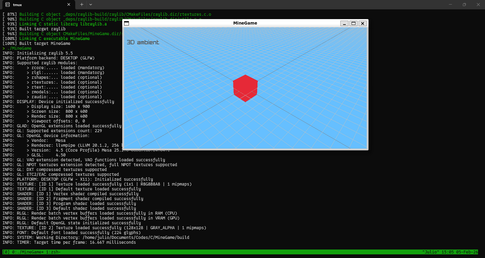
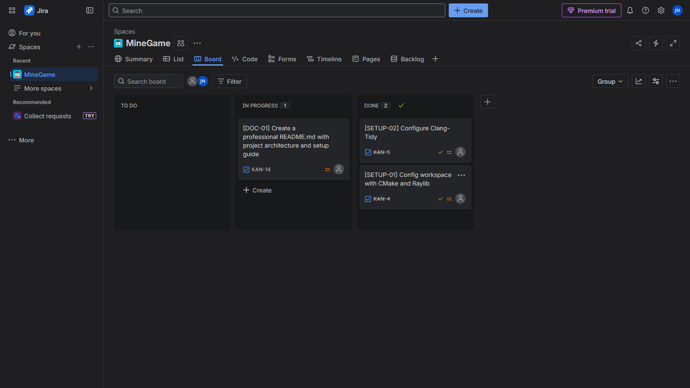

# MineGame: Voxel Engine Experiment

<p align="center">
  
</p>

A minimalist Minecraft-inspired voxel engine built from scratch in **C17** using the **Raylib** library. This project focuses on learning game engine fundamentals, memory management, and clean code practices.

## 🚀 Roadmap to Beta 1
Goal: Establish a functional "Creative Mode" foundation.
- [ ] **Static World:** Render a fixed world composed of a single block type.
- [ ] **Spectator Movement:** Implementation of a 6-DOF camera to fly through the world.
- [ ] **Block Placement:** Ability to add blocks to the grid in real-time.
- [ ] **Block Destruction:** Ability to remove blocks from the grid.

<p align="center">
  
</p>

## 🛠️ Tech Stack
* **Language:** C17
* **Graphics API:** [Raylib 5.5](https://www.raylib.com/)
* **Build System:** CMake (with FetchContent for zero-install dependency management).
* **Static Analysis:** Clang-Tidy.
* **Project Management:** Jira (Agile/Kanban).

## 🔧 Getting Started

### Prerequisites
You only need a C compiler (like **Clang** or **GCC**) and **CMake** installed. The build system will automatically download and compile Raylib for you.

### Build
```bash
mkdir build && cd build
cmake ..
make
