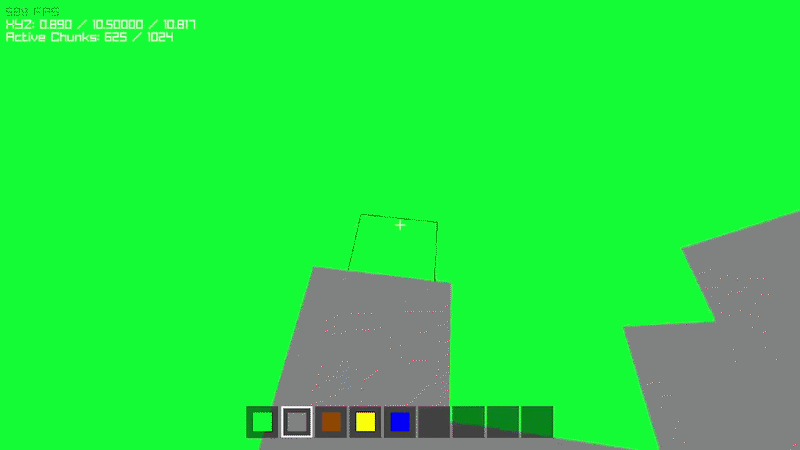

# MineGame: Voxel Engine Experiment

<p align="center">
  
</p>

A minimalist Minecraft-inspired voxel engine built from scratch in **C17** using the **Raylib** library. This project focuses on learning game engine fundamentals, memory management, and clean code practices.

## 🚀 Roadmap to Beta 2
Goal: Transform the engine from a free-roaming spectator into a physically-grounded game world.
- [ ] **Debug Console & Command System:** Implement an in-game text terminal to execute logic functions, list loaded assets from cJSON, toggle debug overlays, etc.
- [ ] **Physical Embodiment:** Replace the flying camera with a physics-aware Player entity using AABB (Axis-Aligned Bounding Box) collision detection.
- [ ] **Dynamic World Management:** Implement a World Handler to manage, render, and "stitch" together multiple chunks (Mesh-culling across chunk borders).
- [ ] **Player Mechanics:** Implementation of gravity, jumping, and ground-level movement (step-up/step-down logic).
- [ ] **Gameplay Loop:** Basic inventory system with a HUD Hotbar and block selection (1-9 keys) to choose materials for building.
- [ ] **Performance Pass:** Transition from Immediate Mode rendering to Vertex Buffer Objects (VBOs) to support larger view distances.

## Beta 1 ✅
Goal: Establish a functional "Creative Mode" foundation.
- [X] **Static World:** Render a fixed world.
- [X] **Spectator Movement:** Implementation of a 6-DOF camera to fly through the world.
- [X] **Block Placement:** Ability to add blocks to the grid in real-time.
- [X] **Block Destruction:** Ability to remove blocks from the grid.

## 🛠️ Tech tack

<p align="center">
  
</p>

* **Language:** C17
* **Graphics API:** [Raylib 5.5](https://www.raylib.com/)
* **cJSON:** [cJSON 1.7.19](https://github.com/DaveGamble/cJSON)
* **Build System:** CMake (with FetchContent for zero-install dependency management).
* **Static Analysis:** Clang-Tidy.
* **Project Management:** Jira (Agile/Kanban).

## 🔧 Getting Started

### Prerequisites

### 🐧 Linux
  - GCC or Clang 
  - CMake 
  - X11/OpenGL development headers.

#### 🪟 Windows (Native PowerShell)
  - [Scoop](https://scoop.sh/) (Recommended) to install: `gcc`, `cmake`, `ninja`.

---

### Build & Run

#### 🪟 Windows (Native PowerShell)
The easiest way is using the provided automation script which handles the Ninja generator and GCC paths:

```powershell
./BuildAndRun.ps1
```

Or you can build it manually

```powershell
cmake -S . -B build -G "Ninja" -DCMAKE_C_COMPILER=gcc
cmake --build build
./build/MineGame.exe
```

### 🐧 Linux

```powershell
mkdir build && cd build
cmake ..
make
./MineGame
```

### ❗Known Issues/Limitations
* **WSL Compatibility:** The cursor might not be disabled as expected when running this project on Windows Subsystem for Linux (WSL).

## 🤝 Credits & Acknowledgments

This project is made possible thanks to these amazing open-source libraries:

* **[raylib](https://github.com/raysan5/raylib)** - A simple and easy-to-use library to enjoy videogames programming.
    * *License:* [zlib/libpng](https://github.com/raysan5/raylib/blob/master/LICENSE)
* **[cJSON](https://github.com/DaveGamble/cJSON)** - Ultralightweight JSON parser in ANSI C.
    * *License:* [MIT](https://github.com/DaveGamble/cJSON/blob/master/LICENSE)

Special thanks to **Ramon Santamaria (@raysan5)** for creating Raylib and the community for the continuous support.
